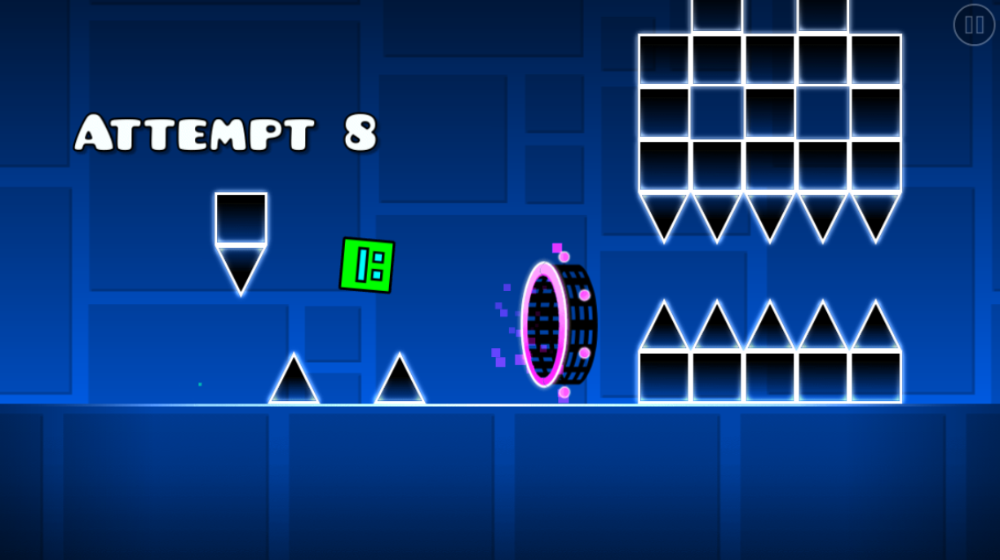

# geometrydash-com-level-override
Modifies the level data to import your own levels instead of Stereo Madness
# How to use
You need to have the [WSLiveEditor](https://github.com/iAndyHD3/WSLiveEditor) mod on geode and be inside the level editor, now reload the [geometrydash.com](https://geometrydash.com/) page and your level should be imported (make sure you have the userscript running!). 
Note: this version of the game is heavily limited and very few objects will work, most notably it's only 1.0 objects and there's no gameplay modifiers other than gamemode portals (no orbs, pads, gravity portals, etc...).
# Example usage

